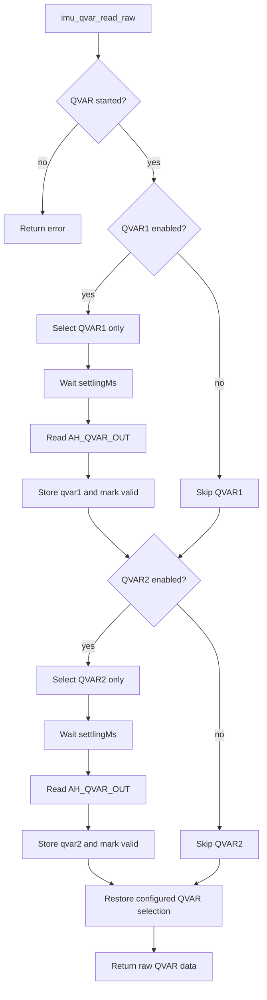
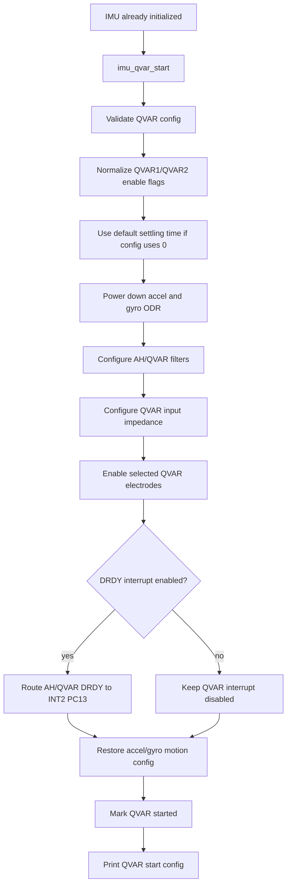
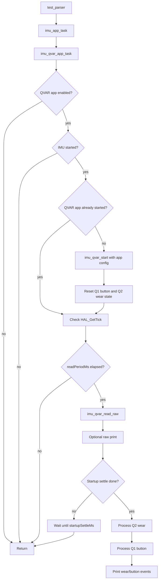
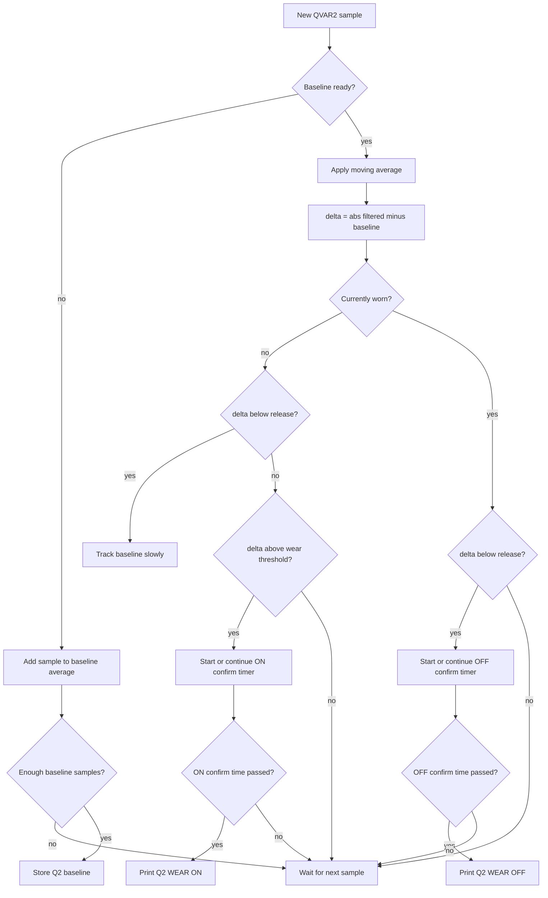
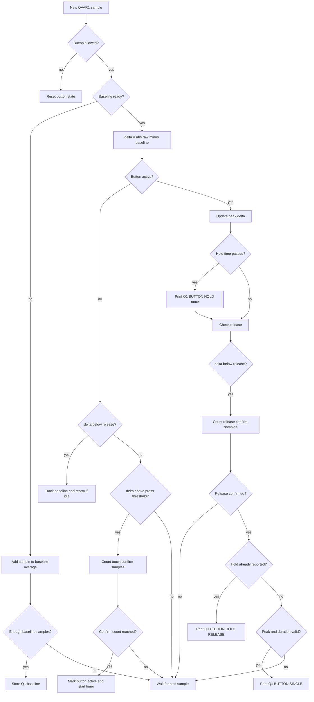
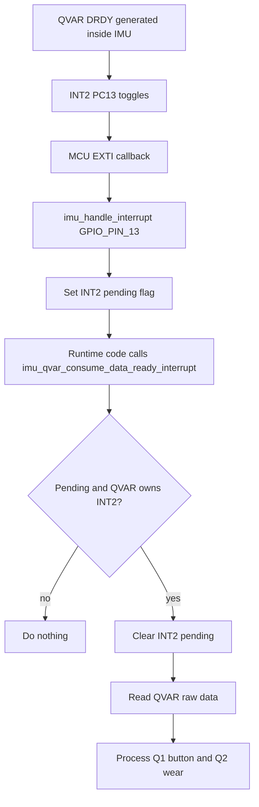

# ISM330BX Qvar Flow

## What Qvar Is

Qvar means electric charge variation. In the ISM330BX it is a high-impedance sensing path that measures changes in quasi-electrostatic potential near external electrodes connected to the IMU pins:

- `AH1/QVAR1`, IMU pin 6
- `AH2/QVAR2`, IMU pin 9

On our schematic these pins are routed as `QVAR1` and `QVAR2` through 499 ohm series resistors, 100 pF capacitors to ground, and ESD protection. They are not MCU GPIOs. The MCU reads Qvar through the IMU over SPI.

## What It Detects

Qvar is useful for proximity/touch-style sensing and electric-field changes around the product. Typical applications:

- Human touch or near-touch detection through an electrode
- Water/liquid presence or contact changes, depending on electrode design
- Wear/contact detection
- Simple gesture/proximity experiments when the mechanical/electrode design supports it

The value is not acceleration. It is a signed analog/electrostatic measurement sampled by the IMU's analog hub/Qvar channel.

## Important Signal Model

The ISM330BX exposes Qvar data through one 16-bit output register pair:

- `AH_QVAR_OUT_L` at `0x3A`
- `AH_QVAR_OUT_H` at `0x3B`

So QVAR1 and QVAR2 are two possible electrode inputs to the same AH/Qvar sensing chain. They are not two independent simultaneous output registers.

To inspect both electrodes as separate values, firmware should:

1. Enable AH/Qvar chain for QVAR1.
2. Wait a short settling time.
3. Read `AH_QVAR_OUT`.
4. Enable AH/Qvar chain for QVAR2.
5. Wait a short settling time.
6. Read `AH_QVAR_OUT`.

This gives a practical `qvar1_raw` and `qvar2_raw` pair, but they are sampled sequentially.

## Raw Read Flow Diagram



## Configuration Flow

1. Bring up IMU over SPI and confirm `WHO_AM_I`.
2. Configure accelerometer in high-performance mode. The datasheet says the accelerometer must be high-performance when Qvar is enabled.
3. Configure AH/Qvar filters:
   - HPF can remove slow DC drift.
   - LPF/notch changes Qvar bandwidth/ODR behavior.
4. Select Qvar input impedance:
   - Higher impedance is more sensitive but can be noisier.
   - Lower impedance is usually more stable but less sensitive.
5. Select electrode path:
   - QVAR1 only
   - QVAR2 only
   - Or switch between them when reading both.
6. Poll data-ready or periodically read `AH_QVAR_OUT`.

## Configuration Flow Diagram



## Interrupt Note

The datasheet exposes AH/Qvar data-ready only on `INT2` through `INT2_DRDY_AH_QVAR`. That means PC13/INT2 can be used for Qvar data-ready. PD0/INT1 is not the Qvar data-ready route.

Threshold/event interrupts such as wake-up/free-fall/6D are different from Qvar data-ready. Qvar thresholding for more advanced behavior would normally be done in firmware after reading raw values, or by using the ISM330BX embedded FSM/MLC features later.

## First Bring-Up Plan

For first validation:

1. Enable both QVAR electrodes in firmware by sequential reading.
2. Print:
   - `QVAR1 raw`
   - `QVAR2 raw`
3. Touch or approach each electrode area and confirm the corresponding raw value changes.
4. Adjust impedance/filter settings if readings are too noisy or too small.

## Firmware Touch Detection

The current test firmware performs detection in `test_parser()` on top of the raw QVAR readings:

1. Read QVAR1 and QVAR2 every 25 ms using normal timed polling.
2. QVAR data-ready on `PC13/INT2` is supported by the driver, but the current test path does not use it.
3. During startup, collect 30 samples for each channel and calculate separate baselines.
4. QVAR1 is processed only as a button:
   - Short valid press prints `Q1 BUTTON SINGLE`.
   - Long valid press prints `Q1 BUTTON HOLD`.
5. QVAR2 is processed only as wear sensing:
   - If `abs(raw - baseline)` stays above `IMU_QVAR2_WEAR_THRESHOLD_RAW`, print `Q2 WEAR ON`.
   - If it stays below `IMU_QVAR2_WEAR_RELEASE_RAW`, print `Q2 WEAR OFF`.
6. While idle, each channel slowly updates its own baseline so temperature/drift does not break detection.

The threshold values are intentionally simple raw-count values for bring-up:

- `IMU_QVAR_SENSITIVITY_PROFILE`
- `IMU_QVAR1_BUTTON_THRESHOLD_RAW`
- `IMU_QVAR1_BUTTON_RELEASE_RAW`
- `IMU_QVAR1_BUTTON_MIN_PEAK_RAW`
- `IMU_QVAR1_BUTTON_MAX_PRESS_MS`
- `IMU_QVAR1_BUTTON_HOLD_TIME_MS`
- `IMU_QVAR2_WEAR_THRESHOLD_RAW`
- `IMU_QVAR2_WEAR_RELEASE_RAW`
- `IMU_QVAR2_WEAR_ON_CONFIRM_MS`
- `IMU_QVAR2_WEAR_OFF_CONFIRM_MS`

Tune these after observing the printed raw values on the real PCB. A good starting point is to keep each threshold clearly above idle noise and each release threshold lower than the active threshold, so the state does not chatter.

For QVAR2 wear tuning, increase the ON/OFF confirmation time if the glass reports wear changes too easily. For QVAR1 button tuning, watch printed `peak` and `duration`; if a real press prints `button ignored`, lower the minimum peak or increase max press time.

Sensitivity profile:

- `0`: less sensitive, best when false triggers happen.
- `1`: normal.
- `2`: more sensitive, useful during bring-up when touches/wear are not detected.

The test prints raw, baseline, and delta every 500 ms:

```text
[IMU] Qvar profile=2 Q1btn=1234 base=900 d=334 Q2wear=2100 base=850 d=1250
```

Use the printed `d=` values to choose thresholds. The active threshold should be above idle noise but below the real touch/wear delta.

## Polling App Flow Diagram

The active QVAR test path is a timed polling flow.



## Wear Detection Flow

QVAR2 is used for wear detection in the glasses use case.



## Button Detection Flow

QVAR1 is used as the button input. If QVAR2 wear sensing is enabled, button
events are accepted only after wear is ON and the arm delay has passed.



## Optional QVAR Interrupt Flow

This is not the active polling test path, but the driver supports QVAR
data-ready on `PC13/INT2`.


