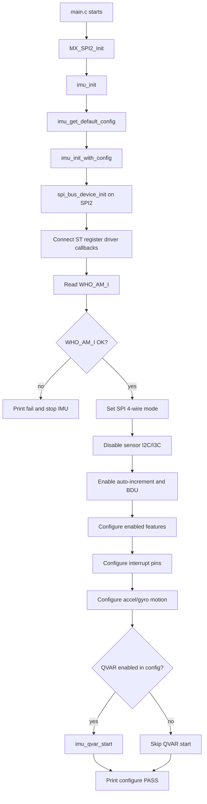
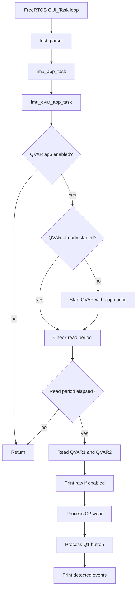
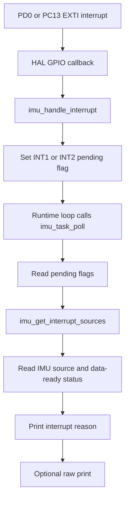
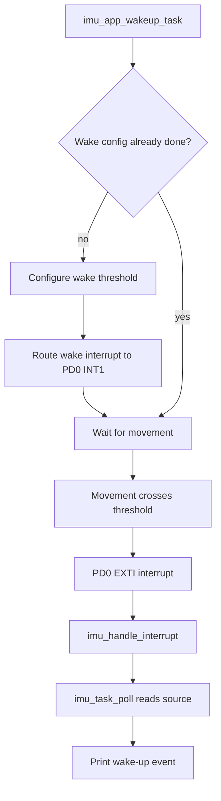

# ISM330BX IMU Implementation

## What Is Implemented

The board uses the ISM330BX 6-axis IMU on `SPI2`. The firmware now has a small IMU layer that talks to the sensor, checks that the sensor is present, reads raw motion data, configures wake-up interrupts, and reads QVAR touch/proximity values.

The implementation is split like this:

- `SPI_Bus`: common SPI read/write helper that can be reused by other SPI sensors later.
- `IMU`: ISM330BX driver wrapper and vendor register driver files.
- `test_parser()`: calls the IMU test functions repeatedly so raw data, interrupts, and QVAR events can be printed.

The IMU layer is now configurable through `imu_config_t`:

- feature enable/disable: accel, gyro, temperature readout, QVAR
- accel full-scale, ODR, and power mode
- gyro full-scale, ODR, and power mode
- interrupt pin mode, polarity, latch/pulse mode, and raw data-ready route
- QVAR1/QVAR2 enable, use case, filter, impedance, settling time, and QVAR data-ready interrupt

`imu_init()` still uses a default board config. Use `imu_init_with_config()` when you want a custom setup.

## SPI2 Communication

The IMU is connected to the MCU through `SPI2`.

The reusable SPI bus layer handles the common SPI actions:

1. Pull chip select low.
2. Send register address.
3. Read or write data.
4. Release chip select high.

This means future SPI sensors can use the same basic read/write functions instead of each sensor having its own SPI code.

Real-world example: it is like using one common road for different devices. The IMU uses that road now, and another SPI sensor can use the same road later with its own chip-select pin.

## IMU Startup Flow

At startup, firmware calls `imu_init()`.

The startup flow is:

1. Configure the IMU SPI device on `SPI2`.
2. Read the `WHO_AM_I` register.
3. Confirm the value matches the expected ISM330BX ID.
4. Disable unused I2C/I3C interface inside the sensor.
5. Enable register auto-increment.
6. Configure accelerometer and gyroscope.
7. Print startup status.

Expected UART example:

```text
[IMU] WHO_AM_I PASS 0x22
[IMU] configure PASS SPI2 accel=2g gyro=250dps odr=120Hz
```

If `WHO_AM_I` fails, it usually means SPI wiring, chip select, power, clock polarity/phase, or the selected SPI instance should be checked.

### Startup Flow Diagram



## Raw Motion Data

The IMU can print raw accelerometer, gyroscope, and temperature values.

Example output:

```text
[IMU] raw A=(120,-40,16300) G=(2,-1,5) T=2500
```

Basic meaning:

- `A` is accelerometer raw X/Y/Z.
- `G` is gyroscope raw X/Y/Z.
- `T` is raw temperature.

Real-world example: if the board is lying flat, one accelerometer axis should show a large value because gravity is acting on that axis. If you rotate the board, the large value moves to another axis.

## Wake-Up Interrupts

The firmware supports wake-up threshold interrupts from the IMU.

Current test configuration:

- Wake threshold: `250 mg`
- Duration: `1` sample
- Route: `PD0/INT1`

When shaking or moving the board crosses the configured threshold, the IMU interrupt pin changes and the firmware prints the interrupt source.

Example output:

```text
[IMU] int INT1=1 INT2=1 WU=1 xyz=(1,0,0) FF=0 6D=0 sleep=0/0
[IMU] pin PD0=1 PC13=1
```

Real-world example: this can be used to wake the product when a vehicle starts moving, when the device is picked up, or when vibration crosses a selected limit.

Raw accelerometer/gyroscope data-ready can also be routed to `PD0/INT1`, `PC13/INT2`, both, or none through `imu_interrupt_pin_config_t.raw_data_ready_route`.

## QVAR Touch/Proximity

The IMU also has QVAR inputs connected as `QVAR1` and `QVAR2`.

QVAR does not measure movement. It measures electric charge variation on external electrodes. This can be used for simple touch, near-touch, or contact detection depending on the PCB/electrode design.

Current firmware reads QVAR1 and QVAR2, learns a baseline, and detects:

- QVAR1: button use case, such as single press and press-hold
- QVAR2: wear sensing use case

Example output:

```text
[IMU QVAR] Q1 BUTTON SINGLE raw=2050 peak=1180 duration=150 ms
[IMU QVAR] Q1 BUTTON HOLD raw=2300 peak=1500
[IMU QVAR] Q2 WEAR ON raw=2100 delta=1200 baseline=900
[IMU QVAR] Q2 WEAR OFF raw=980 delta=80 baseline=900
```

Real-world example: QVAR2 can detect whether the glasses are being worn, while QVAR1 can act like a small hidden button on the frame.

More QVAR details and tuning notes are in `qvar.md`.

## QVAR Polling And Interrupt Options

The basic QVAR path does not provide a simple threshold-crossed interrupt register. It provides QVAR data-ready on `INT2`, which is `PC13` on this board.

Current test mode:

- QVAR is read by timed polling every 25 ms.
- QVAR1 is processed as button/touch sensing.
- QVAR2 is processed as wear sensing.
- PC13 QVAR data-ready interrupt is disabled in the test config.

Optional interrupt-based split:

- `PD0/INT1`: motion/wake-up threshold interrupt
- `PC13/INT2`: QVAR data-ready interrupt

Optional interrupt-based firmware flow:

1. PC13 interrupt occurs.
2. `imu_qvar_consume_data_ready_interrupt()` confirms QVAR data-ready.
3. Firmware reads QVAR1 and QVAR2.
4. QVAR1 is processed as button/touch sensing.
5. QVAR2 is processed as wear sensing.

For true in-chip QVAR threshold interrupts, the next path to explore is ISM330BX FSM/MLC programming. That is more advanced than the basic QVAR read path.

## Config Examples

Normal raw motion mode:

```c
imu_config_t imu_config;
imu_get_default_config(&imu_config);
imu_config.features.accel_enable = 1;
imu_config.features.gyro_enable = 1;
imu_config.features.temperature_enable = 1;
imu_config.features.qvar_enable = 0;
imu_config.motion.accel_full_scale = IMU_ACCEL_FS_2G;
imu_config.motion.accel_odr = IMU_ACCEL_ODR_120HZ;
imu_config.motion.gyro_full_scale = IMU_GYRO_FS_250DPS;
imu_config.motion.gyro_odr = IMU_GYRO_ODR_120HZ;
imu_init_with_config(&imu_config);
```

QVAR wear/button mode:

```c
imu_config_t imu_config;
imu_get_default_config(&imu_config);
imu_config.features.qvar_enable = 1;
imu_config.qvar.enable_qvar1 = 1;
imu_config.qvar.enable_qvar2 = 1;
imu_config.qvar.qvar1_use = IMU_QVAR_USE_BUTTON;
imu_config.qvar.qvar2_use = IMU_QVAR_USE_WEAR;
imu_config.qvar.data_ready_interrupt_enable = 0;
imu_init_with_config(&imu_config);
```

## Low-Power Direction

Useful low-power modes to test next:

1. Motion wake-only mode:
   - accel enabled at low ODR
   - gyro disabled
   - wake-up interrupt on PD0
   - MCU sleeps until PD0 interrupt

2. QVAR wear/button mode:
   - QVAR enabled
   - QVAR data-ready interrupt on PC13
   - MCU reads QVAR only after PC13 interrupt
   - firmware decides wear/button events

3. Full active mode:
   - accel and gyro enabled at higher ODR
   - raw data or wake events available
   - highest current, best motion data

4. Deep idle mode:
   - accel ODR off
   - gyro ODR off
   - QVAR off
   - MCU can stop reading the IMU until another system event requires it

From the vendor driver note, AH/QVAR should be enabled when accel and gyro are in power-down mode. That means the clean low-power design is to treat QVAR mode and full motion mode as separate profiles, then switch profiles when needed.

The ISM330BX is not the magnetometer. The project magnetometer is a separate sensor on I2C. Enable/disable for magnetometer should stay in the magnetometer driver, while IMU enable/disable covers accel, gyro, temperature readout, QVAR, and embedded IMU functions.

## Main Runtime Flow

The current simple runtime flow is:

1. `main.c` initializes hardware and calls `imu_init()`.
2. `imu_init()` checks `WHO_AM_I` and configures the sensor.
3. `TouchGFX_Task()` runs continuously.
4. `TouchGFX_Task()` calls `test_parser()` every loop.
5. `test_parser()` calls `imu_app_task()`.
6. Current `imu_app_task()` calls `imu_qvar_app_task()`.
7. UART/SWV prints QVAR raw data and detected QVAR events.

Current code note:

- `imu_task_poll()` is available for interrupt/raw polling, but the call inside
  `imu_app_task()` is currently commented.
- `imu_app_wakeup_task()` is available as a wake-up test helper, but the call
  inside `imu_app_task()` is currently commented.

### Current Runtime Flow Diagram



### Optional Motion Interrupt Flow Diagram

This flow applies when `imu_task_poll()` is called from the runtime loop and
the interrupt route is enabled.



### Optional Wake-Up Threshold Flow Diagram

This flow applies when `IMU_APP_WAKEUP_ENABLE` is enabled and
`imu_app_wakeup_task()` is called.



## Files To Check

- `SPI_Bus/Inc/spi_bus.h`
- `SPI_Bus/Src/spi_bus.c`
- `IMU/Inc/imu.h`
- `IMU/Src/imu.c`
- `IMU/Inc/ism330bx_reg.h`
- `IMU/Src/ism330bx_reg.c`
- `Engine/Src/test.cpp`
- `Core/Src/main.c`

## Simple Debug Checklist

If IMU is not working:

1. Check `WHO_AM_I` output first.
2. Check IMU power rails.
3. Check SPI2 pins and chip select.
4. Check that `MX_SPI2_Init()` is called.
5. Check that `imu_init()` returns `HAL_OK`.
6. For interrupts, check PD0 and PC13 GPIO EXTI configuration.
7. For QVAR, watch raw values first before tuning touch thresholds.

## ESP32 / FreeRTOS Port (`project/`)

The firmware has also been ported to ESP-IDF / FreeRTOS in the `project/` directory:
- **I2C Transport:** Uses ESP32 `driver/i2c.h` with I2C master configuration (SDA=GPIO 21, SCL=GPIO 22).
- **FreeRTOS Timing:** In `project/main/qvar.c`, all HAL timing functions (`HAL_GetTick()`, `HAL_Delay()`) are ported to FreeRTOS primitives:
  - `(xTaskGetTickCount() * portTICK_PERIOD_MS)` manages polling intervals and baseline tracking.
  - `vTaskDelay(pdMS_TO_TICKS(settlingMs))` provides electrode settling delays.
- **Active Profile:** Configured in `project/main/qvar_config.h` via `QVAR_APP_ACTIVE_CONFIG` as `QVAR_APP_CONFIG_BUTTON_Q1_ONLY`.

